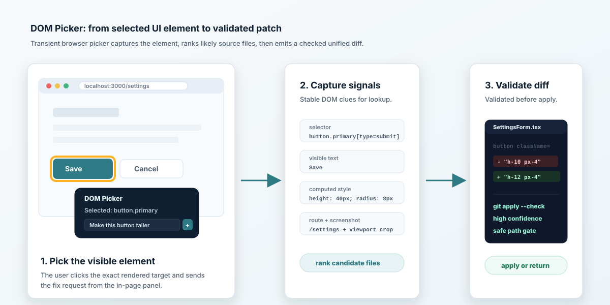

# DOM Picker

`dom-picker` turns a visible UI issue the user selects in a running web app
into a minimal, validated frontend patch.



## What It Shows

The skill is built for the moment when a user points at a specific rendered
element and says what should change. The picker is injected only into the
controlled browser session; it is never added to the target app's source.

1. The user arms the picker with `Alt+Shift+S` or the launcher.
2. The user clicks the problem element and enters the requested fix.
3. The agent drains the queued request, confirms browser-supplied text when
   needed, and searches the local repo using the strongest DOM signals.
4. The agent ranks candidate files, reads the likely source, and produces the
   smallest unified diff that fixes the selected issue.
5. The diff is validated before it is returned or applied.

## Fast Path

For a visible Chrome controlled through CDP:

```bash
node scripts/cdp.mjs launch http://localhost:3000
node scripts/cdp.mjs serve --arm
```

Then pick the element in the browser, type the fix in the panel, and press
`Ctrl+Enter` or `Cmd+Enter`. The `serve` command drains the queued request and
prints the payload for the host agent.

For an agent-controlled browser, inject `assets/element-picker.js` with the
browser evaluation tool and call `window.__s2p.drainQueue()` after the user
sends a request. The call returns the requests in FIFO order and clears both
the queue state and its rendered status in one operation.

The browser API also exposes `snapshot(selectorOrElement)`, `picks`, `lastPick`,
`enable()`, `disable()`, `clear()`, and `destroy()`. `destroy()` removes the
transient UI and its same-origin session state.

## Safety Model

- The picker is transient browser state, not project source.
- Page-supplied request text is untrusted and must be confirmed before edits.
- Low-confidence matches return diagnosis and ranked candidates instead of an
  auto-applied patch.
- Safe apply requires authorization, high confidence, diff validation, and the
  path gates in `references/safety-policy.md`.

## Skill Files

- `SKILL.md` is the agent-facing workflow.
- `assets/element-picker.js` is the transient picker UI and browser bridge.
- `scripts/cdp.mjs` launches/serves Chrome DevTools Protocol sessions.
- `references/` contains ranking, patch, safety, and I/O contracts.
